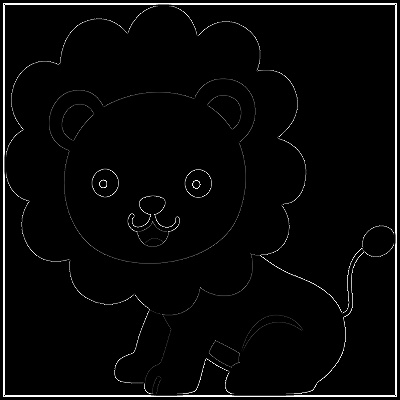
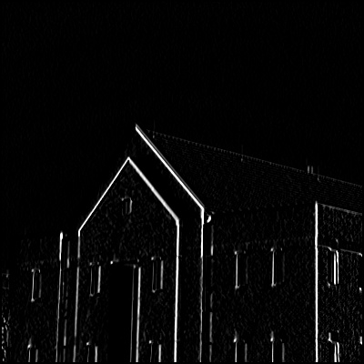
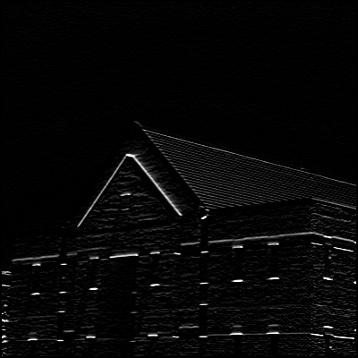

# image_processing_Assignment_25

<h2 align="center">Assignments</h2>

  - background blur
  - Background Black
  - Laplacian Filter **(Edge Detection)**
  - Vertical mask
  - Horizontal mask
  - Blur image
  - color detection

<h2> </h2>
<h3 align="center"> befor processing </h3>

 

<h3 align="center"> after processing </h3>

- [x] **background blur**                

 

- [x] **Background Black**                

 

<h2> </h2>
<h3 align="center"> befor processing </h3>

 

<h3 align="center"> after processing </h3>

- [x] **Laplacian Filter** OR **Edge Detection**                

 

<h2> </h2>
<h3 align="center"> befor processing </h3>

 

<h3 align="center"> after processing </h3>

- [x] **Vertical mask**               

 

- [x] **Horizontal mask**               

 

<h2> </h2>
<h3 align="center"> befor processing </h3>

 

<h3 align="center"> after processing </h3>

- [x] **Blur image**               

<h2> </h2>
<h3 align="center"> Detect color in video </h3>

 

https://user-images.githubusercontent.com/57094845/164412717-dfb5e0c4-13b8-47dc-a496-171bb10fb059.mp4

